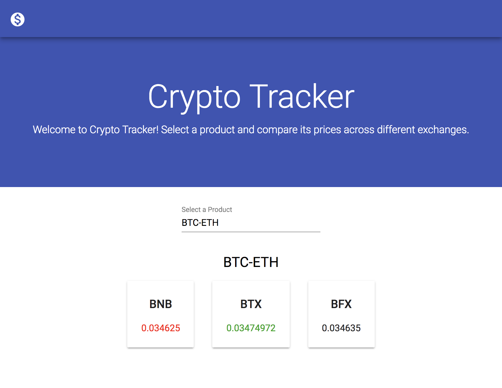

# Crypto Tracker

## Running the App

The app uses some sensitive information stored in a file in `conf/sensitive.conf`. This file is not pushed to the git repo for security purposes, but is included in the `.zip` file. The file `conf/sensitive.conf` needs to exist and contain correct credentials for the app to work correctly.


To run the app, navigate to the root directory and run:
```
./sbt runProd
```

You can now use the app running at `localhost:9000`

## Backend Overview
### Endpoints
The backend has two endpoints:
- **/products**
    - Returns all products shared between the exchanges.
- **/products/{product}/prices**
    - Returns the given product’s prices on all three exchanges.
    - **Notice:** Some products turn up on all three exchanges but do not have prices in all of them. In those cases, a status 500 is returned.
    
### Framework and Language
I decided to use [Play Framework](https://www.playframework.com/) as the backend framework with [Scala](https://www.scala-lang.org/). Play is a web framework for Java and Scala, based on Akka.

## Frontend Overview
The fronted app consists of a welcome message, a filterable select to choose a product, and a section for the selected product information.



### Framework and Language
I used [Angular 6](https://angular.io/) as the frontend framework, with HTML, [Typescript](https://www.typescriptlang.org/) and [Sass](https://sass-lang.com/).  
I also used [Angular Material](https://material.angular.io/) components library for styling.